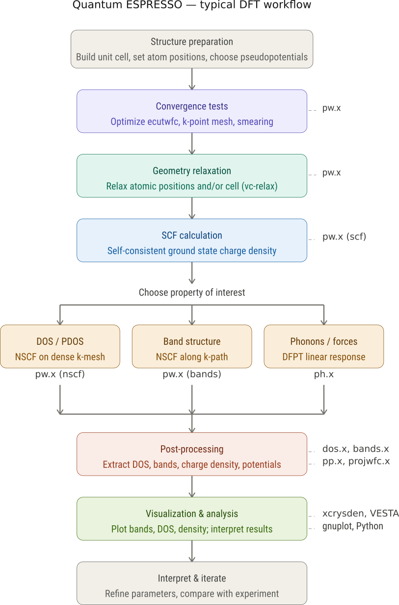

## What a typical QE Workflow is like {.scrollable}

QE is not one code but a suite of codes. 

::::{.columns}
:::{.column}
{width=1200}
:::
:::{.column style="font-size:0.9em"}

```
&CONTROL
    calculation = 'scf'            ! Type of calculation (scf, relax, vc-relax, etc.)
    prefix      = 'silicon'        ! Prefix for output files (e.g., silicon.save)
    pseudo_dir  = './pseudo/'      ! Directory where pseudopotentials are stored
    outdir      = './tmp/'         ! Directory for temporary files
/
&SYSTEM
    ibrav     = 2                  ! Bravais lattice index (2 = Face-Centered Cubic)
    celldm(1) = 10.26              ! Lattice constant 'a' in Bohr (1 Bohr ≈ 0.529 Å)
    nat       = 2                  ! Total number of atoms in the unit cell
    ntyp      = 1                  ! Number of different atomic species
    ecutwfc   = 30.0               ! Kinetic energy cutoff for wavefunctions (Rydberg)
/
&ELECTRONS
    conv_thr    = 1.0d-8           ! Convergence threshold for SCF energy
    mixing_beta = 0.7              ! Mixing factor for charge density iterations
/
ATOMIC_SPECIES
    Si  28.086  Si.pbe-n-kjpaw_psl.1.0.0.UPF  ! Symbol, Mass, Pseudopotential file name

ATOMIC_POSITIONS (alat)
    Si 0.00 0.00 0.00              ! Position of the first silicon atom
    Si 0.25 0.25 0.25              ! Position of the second silicon atom

K_POINTS (automatic)
    4 4 4 1 1 1                    ! Monkhorst-Pack grid: nx ny nz and offsets

```

:::
::::

An understanding of each aspect is crucial.

## What is working with ASE/RDkit/pymatgen like 


  
<iframe src="https://code4np.github.io/posts/chemsim_2024_02_28/index.html"
 width="150%" height="100%" style="border:none;"></iframe>
