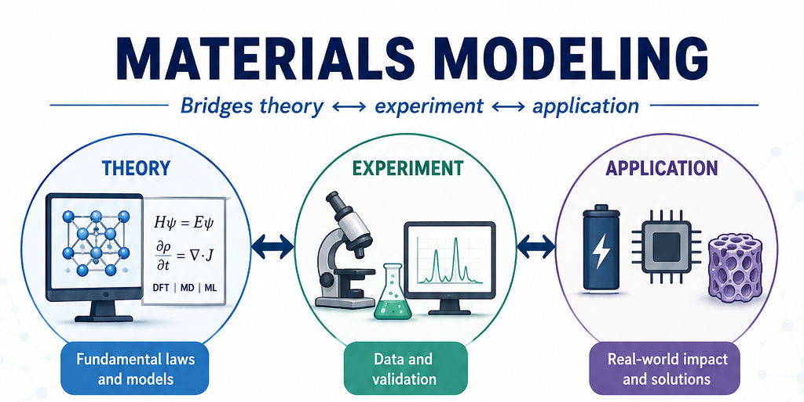
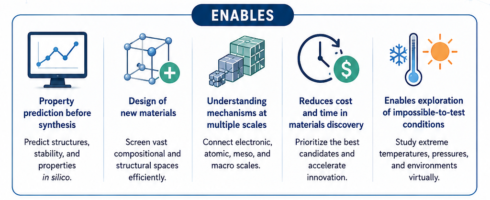
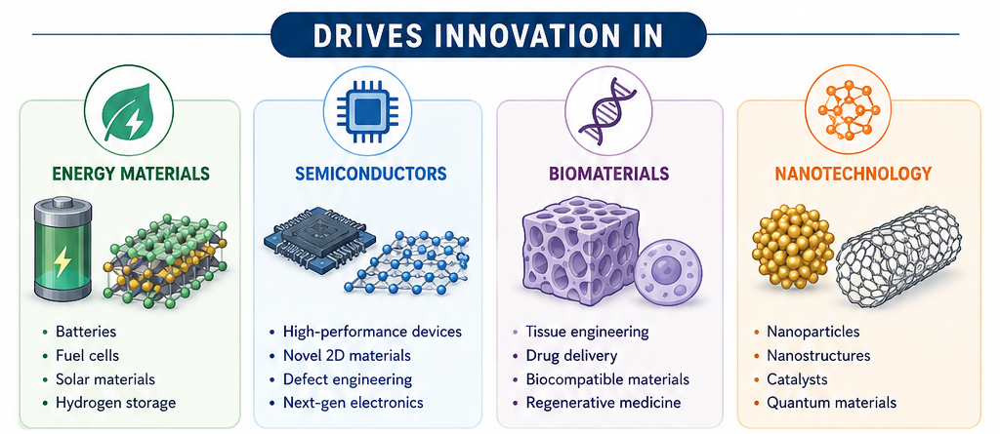

<r>Materials Modeling</r> is the use of **physics-based or data-driven methods** to understand and predict material behavior. 

::: {style="text-align: center;"}

  
CORE IDEA

  

Replace expensive experiments with **predictive computation**
  

:::

We like it because...

:::{.fragment}
{fig-align=center}
:::
:::{.fragment}
{fig-align=center}
:::
:::{.fragment}
{fig-align=center}
:::

## Landscape [continued] {.scrollable}

::::{.ddm}
:::{.ddm-head onclick="toggleBox(this)"}
Some active research groups
:::
:::{.ddm-box}

:::{.sans style="font-size: 0.7em;color: #222222;"}
|  | |  |  |  |
|-------|---|---|-----|---|
| **Electronic Structure / Quantum Materials** | **Materials Project** | **OQMD** | **NOMAD Laboratory** | **C2SEPEM** |
| **Machine Learning for Materials** | **FAIR Chemistry** | **DeepMind** | **Microsoft Research** | **Toyota Research Institute** |
| **Special Materials   (MOFs / Porous Materials / Energy Materials)** | **Wilmer Lab** | **Snurr Research Group** | **Smit Group** | **Kulik Group** |
| **Multiscale / Molecular Dynamics / Computational Mechanics** | **LAMMPS Development Team** | **Materials Theory Group (Imperial College London)** | **Max Planck Institute for Iron Research** |  |
| **Europe-Based Centers Strong for MSCA/Postdoc Opportunities** | **CECAM** | **Institute of Science and Technology Austria** | **Forschungszentrum Jülich** |  |
::: 

[There are TONS more.]{.highlight}

:::
::::

::::{.ddm}
:::{.ddm-head onclick="toggleBox(this)" style=""}
How you can contribute
:::
:::{.ddm-box}

::::{.ddp}
:::{.ddp-head onclick="toggleBox(this)"}
METHOD Developer
:::
:::{.ddp-box}
Creates, refines, and validates the theoretical frameworks, algorithms, and software tools used to simulate and predict the behavior of materials
:::
::::

::::{.ddp}
:::{.ddp-head onclick="toggleBox(this)"}
CODE Builder
:::
:::{.ddp-box}
Creates, maintains, and optimizes software used to simulate the physical and chemical properties of materials at atomic, molecular, or continuum scales
:::
::::

::::{.ddp}
:::{.ddp-head onclick="toggleBox(this)"}
END User
:::
:::{.ddp-box}
Applies computational simulation software to understand, design, or optimize materials without necessarily developing the underlying simulation code themselves
:::
::::

:::
::::

## Major Branches of Materials Modeling {.scrollable}

::::{.ddm}
:::{.ddm-head onclick="toggleBox(this)" style="background-color: white;"}
The multiscale nature of modeling
:::
:::{.ddm-box}
- Materials behavior spans:
  - **Electrons → atoms → microstructure → devices**
- No single method covers everything

**Key challenge:** Linking scales consistently

Where you start depends on your question and background.
What you need to know depends on what you want to do. You can start with a simple model and build up as needed. The important thing is to understand the assumptions and limitations of your chosen method.
:::
::::

::::{.columns}
:::{.column}
<!-- column 1 -->
::::{.ddm}
:::{.dd-head onclick="toggleBox(this)"}
Quantum Mechanical Methods
:::
:::{.dd-box}
- Based on **first principles (ab initio)**
- Examples:
  - Density Functional Theory (DFT)
- Used for:
  - Electronic structure
  - Band structure
  - Defects
:::
::::

::::{.ddm}
:::{.dd-head onclick="toggleBox(this)"}
Atomistic Simulations
:::
:::{.dd-box}
- Treat atoms explicitly
- Examples:
  - Molecular Dynamics (MD)
  - Monte Carlo

- Used for:
  - Diffusion
  - Thermal properties
  - Structural evolution

:::
::::

::::{.ddm}
:::{.dd-head onclick="toggleBox(this)"}
Mesoscale Modeling
:::
:::{.dd-box}
- Coarse-grained descriptions
- Examples:
  - Phase-field models
  - Kinetic Monte Carlo

- Used for:
  - Microstructure evolution
  - Grain growth
  - Defect dynamics

:::
::::

:::
:::{.column}
<!-- column 2 -->

::::{.ddm}
:::{.dd-head onclick="toggleBox(this)"}
Continuum Modeling
:::
:::{.dd-box}
- Treat material as continuous medium
- Examples:
  - Finite Element Method (FEM)

- Used for:
  - Mechanical behavior
  - Device-scale simulations

:::
::::

::::{.ddm}
:::{.dd-head onclick="toggleBox(this)"}
Data-Driven Modeling
:::
:::{.dd-box}
- Machine Learning + Materials Science
- Examples:
  - Property prediction models
  - Generative materials design

- Key shift:
  - From **physics-only → physics + data**

:::
::::
<!-- column 2 end -->
:::
::::

